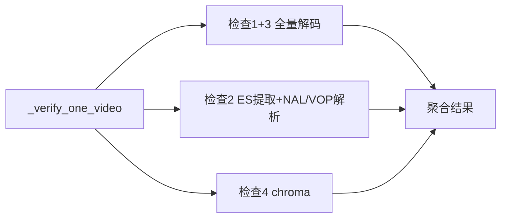

## 用户需求

分析 `tests/verify_segment_bitstream_v3.py` 单文件大视频验收的性能瓶颈，重点评估分片并行运算的可行性，并要求覆盖以下四个维度：

- 不同分片策略（按大小、按行、按记录）的适用场景与优缺点
- 并行处理框架（多线程、多进程、分布式计算）的选择依据
- 内存管理与 I/O 优化对整体性能的影响
- 分片粒度与任务调度开销的平衡

最终交付物为「分析报告 + 落地改造方案」：先给出分析结论与技术方案对比，再给出可实施、含具体改动点的代码改造计划；评估范围同时覆盖「单文件大视频内部并行」与「大规模批处理/分布式」两类场景。

## 核心痛点

性能日志显示：hevc 86887 帧视频，CPUx8 / 33.3GB，即使 `--skip-chroma`，单文件验收仍耗时约 400~450 秒。根因在于 `_verify_one_video` 对单个文件串行执行 4 项检查，现有 `run_verify_parallel` 并行引擎只对「多个文件」生效，对「单个大文件」无效。

## 技术栈

- Python 3.9+，复用现有脚本 `tests/verify_segment_bitstream_v3.py`（2223 行）
- ffmpeg / ffprobe（`shutil.which` 查找，`subprocess(shell=False)`）
- 现有工具 `src/utils/video_utils.py` 的 `split_video_by_time()`（`-c copy` + segment muxer，不重编码）
- `concurrent.futures`（ThreadPoolExecutor / ProcessPoolExecutor，脚本已引入）

## 分析方案

基于已读源码与性能日志，采用「检查级依赖分析」定位瓶颈，将用户四个维度映射到视频领域：

- 按大小分片 → 按字节切 Annex B ES
- 按行分片 → 按 NAL / VOP 记录切分
- 按记录分片 → 按帧 / 按时间切分（ffmpeg segment muxer）

## 关键可行性结论

1. 主瓶颈是 `check_decode_integrity()` 的一次 `ffmpeg -v verbose -f null -vf showinfo` 全量解码。检查 1（frames==packets 守恒）与检查 3（pts 连续性）均为全局/跨段性质，按时间或字节分片会破坏语义（段切分点即新 GOP/IDR，`-reset_timestamps 1` 使 pts 归零），因此对主瓶颈「分片并行」不可行。
2. 检查 2（NAL/VOP 解析）是单线程 Python + `capture_output=True` 全量 ES 内存驻留，是可优化的第二瓶颈，且与检查 1 无数据依赖。
3. 检查 4（chroma 像素域）是 embarrassingly parallel 的局部性质，是唯一适合分片并行的检查项，但日志场景均 `--skip-chroma`。
4. 最优落地策略是「检查间并行」而非按时间分片：用线程将检查 2 的 ES 提取 + 解析与检查 1+3 的全量解码重叠执行，I/O 与 CPU 重叠，在不破坏任何检查语义的前提下缩短墙钟时间。

## 落地改造方案要点（具体改动点）

- `_verify_one_video()`：将检查 2 抽为线程任务，与检查 1+3 并行，`join` 后聚合结果；保留原返回 dict 结构以保证兼容。
- `extract_annexb_es()`：`capture_output=True` 改为流式写临时文件或增量解析，降低峰值内存。
- `parse_h264_es()` / `parse_hevc_es()` / `parse_mpeg4_es()`：维持 O(ES_size)，补充分块边界处理以支持流式解析。
- `check_chroma_corruption()`：可选按帧区间分片多进程并行（唯一安全分片项）。
- 分布式：多机批处理由现有 `run_verify_parallel` 无法跨机，需引入任务分片 + 结果聚合（报告中评估，非本轮实现）。

## 实施约束

- 遵守跨平台铁律（pathlib / shutil.which / shell=False / encoding='utf-8'）
- 最小化改动、外科手术式编辑，保留原有注释，不改动无关逻辑
- `tests/` 非 pytest 套件，脚本直接运行验证